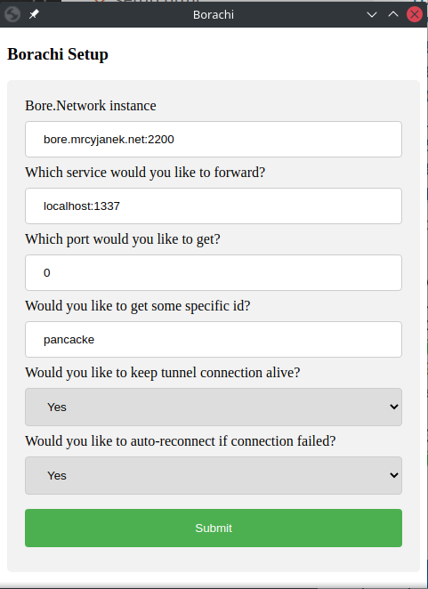
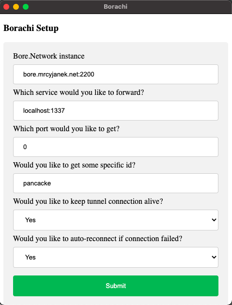

# Borachi

Because Hamachi is non-free and doesn't really work.

### What is Borachi?

Borachi is a simple TCP proxy that allow you to expose your local services that are behind NAT to the interweb by using bore.network!

### Installation

[](https://ci.mrcyjanek.net/repos/448)

You can grab a static binary (linux, macos, android, windows) from: 

 - <details><summary>Linux </summary>

    
 
    [amd64](https://static.mrcyjanek.net/abstruse/borachi/borachi_linux_amd64) [386](https://static.mrcyjanek.net/abstruse/borachi/borachi_linux_386) [arm64](https://static.mrcyjanek.net/abstruse/borachi/borachi_linux_arm64) [arm](https://static.mrcyjanek.net/abstruse/borachi/borachi_linux_arm)

   </details>
 - <details><summary>Android</summary>
    
    <!---->
    
    [all](https://static.mrcyjanek.net/abstruse/borachi/android.all.apk)
    
   </details>
 - <details><summary>Darwin</summary>

     
  
     [amd64](https://static.mrcyjanek.net/abstruse/borachi/borachi_darwin_amd64.zip)
  
   </details>
 - <details><summary>windows </summary>

     <!---->
     [amd64](https://static.mrcyjanek.net/abstruse/borachi/borachi_windows_amd64.exe) [386](https://static.mrcyjanek.net/abstruse/borachi/borachi_windows_386.exe)

   </details>

<!--
Or you can use my apt repository:

```bash
# wget 'https://static.mrcyjanek.net/abstruse/apt-repository/mrcyjanek-repo/mrcyjanek-repo_2.0-1_all.deb' -O cyjanrepo.deb && \
    apt install ./cyjanrepo.deb && \
    rm ./cyjanrepo.deb && \
    apt update && \
    apt install borachi -y
``` 
that way you will be sure that you will be always up to date.
-->